# Lab 1: Deploy a Kubernetes Cluster

# Overview
This lab is designed to expose the participant to the ease of creating a Kubernetes cluster with DC/OS.  As part of this lab you will have the opportunity to learn the following:
* Learn how to log into DC/OS and navigate the platform
* How to quickly create a kubernetes cluster isolated for your team using the DC/OS GUI

**Estimated time required:** 30 minutes

## Requirements
* A healthy DC/OS Cluster with at least 8 nodes
* 'kubernetes' user defined with password 'password'
* 'kubernetes-cluster1' service account is defined

## Part 1: Deploy a Kubernetes Cluster
### Add the Kubernetes Cluster 

1. Your cluster key properties

| Team Project Property | Project Value  |
|-----------------------|----------------|
| Cluster Name          |  ___________________________________              |
| DCOS_MASTER_URL | ___________________________________ |
| PUBLIC_IP     |  ___________________________________              |
|

1. From your browser open the url $DCOS_MASTER_URL.  You will see a login box and you will enter the user id and password:

|            |             |
|------------|-------------|
| user id  | bootstrapid |
| password | deleteme |

When you have logged on successfully, you will see the following dashboard for the DC/OS instance to which you logged in.

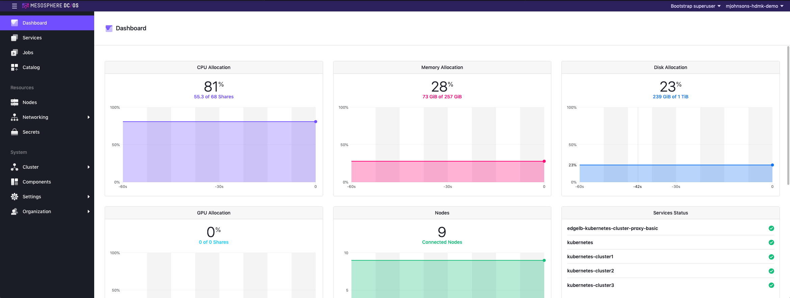
 
1. Verify the Kubernetes Cluster Manager has deployed
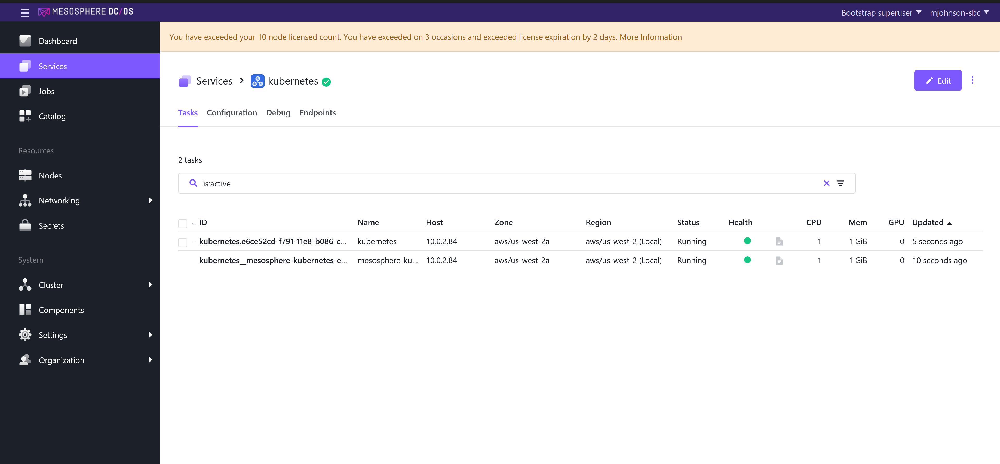

1. Search for the Kubernetes Cluster option in the catalog
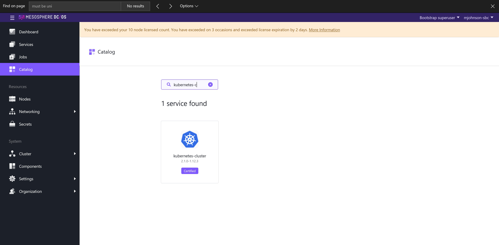

1. Select the Kubernetes Cluster option and modify the default properties as shown in the screen prints below
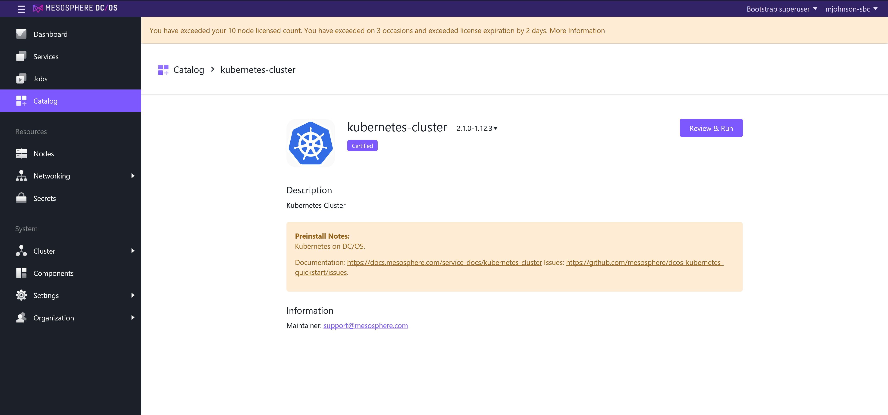

1. For the Kubernetes cluster service, specify the Service name as "kubernetes-cluster1", the "Service Account Name" as "kubernetes-cluster1" and the "Service Account Secret" to "kubernetes-cluster1/sa"
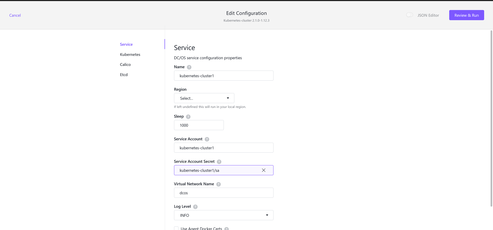

1. Specify the Cpus to 1 as part of the "Kubernetes" section definition
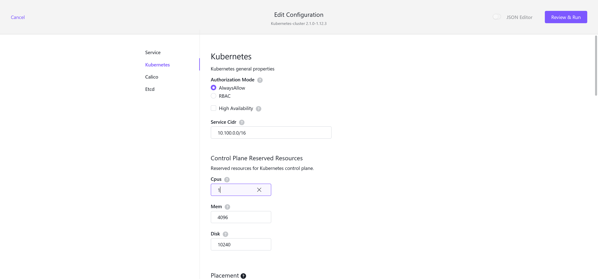

1. Specify the kube-Cpus to 1 as part of the "Kubernetes" section definition.
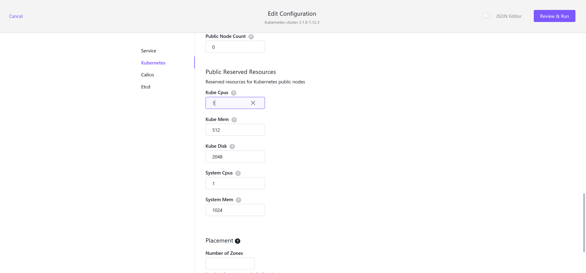

1. Review the Calico CNI network section (You will not need to make any changes)
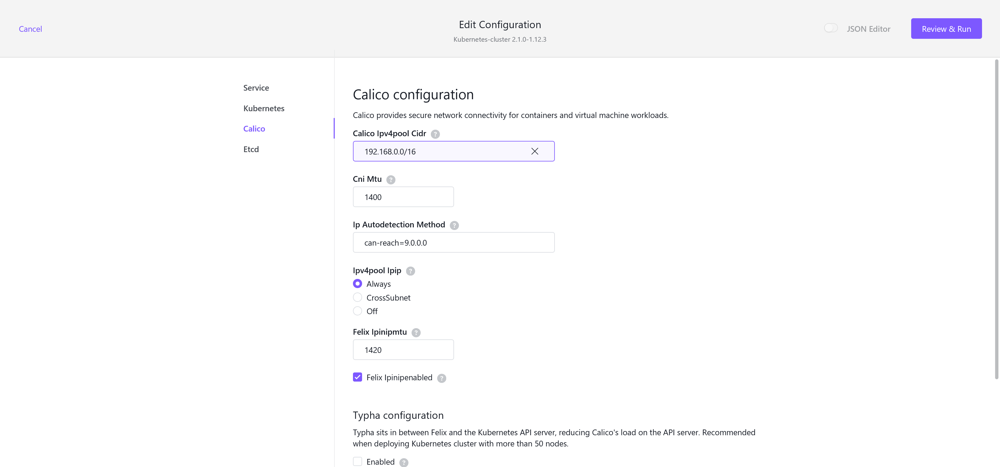

1. Change the etcd CPU count to 1
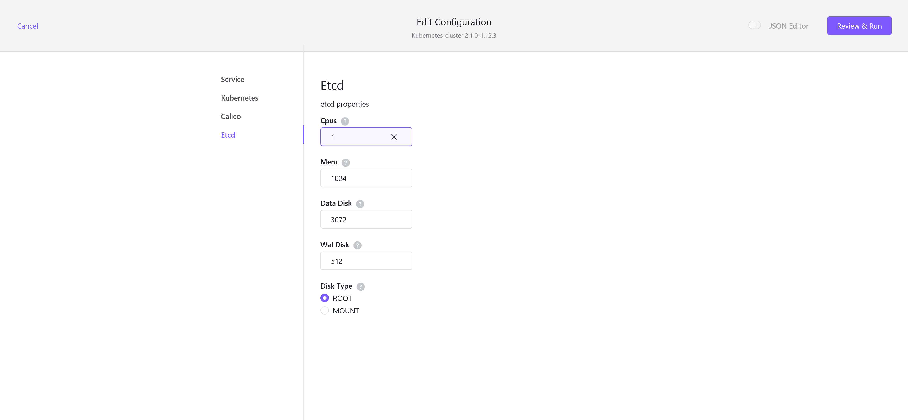

1. Click review and run to confirm the properties are properly selected, then click on "Run Service"
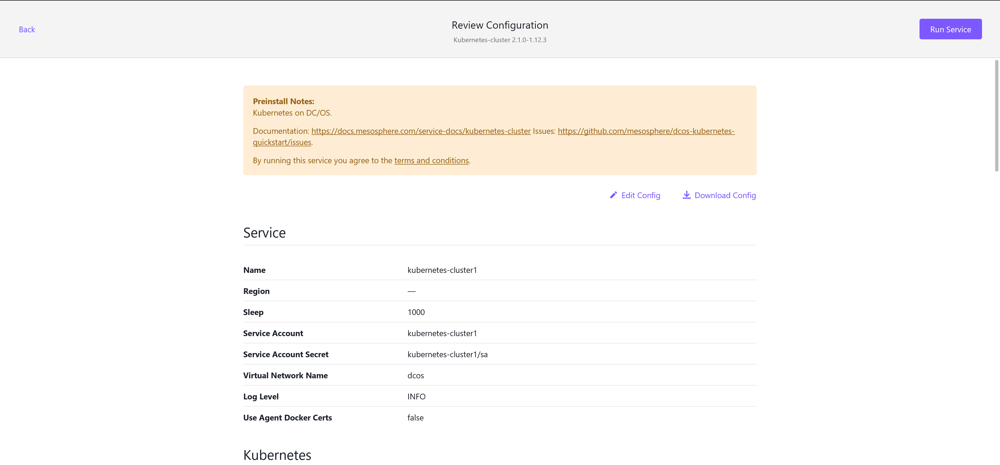

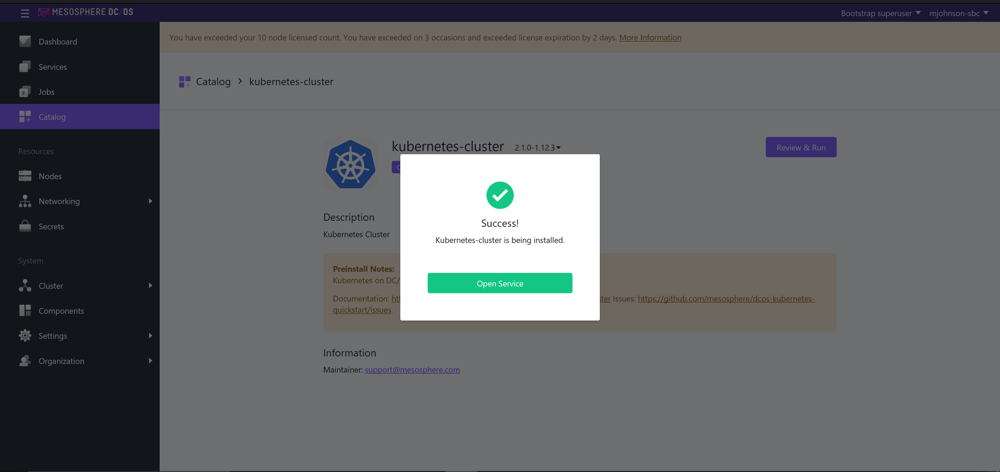

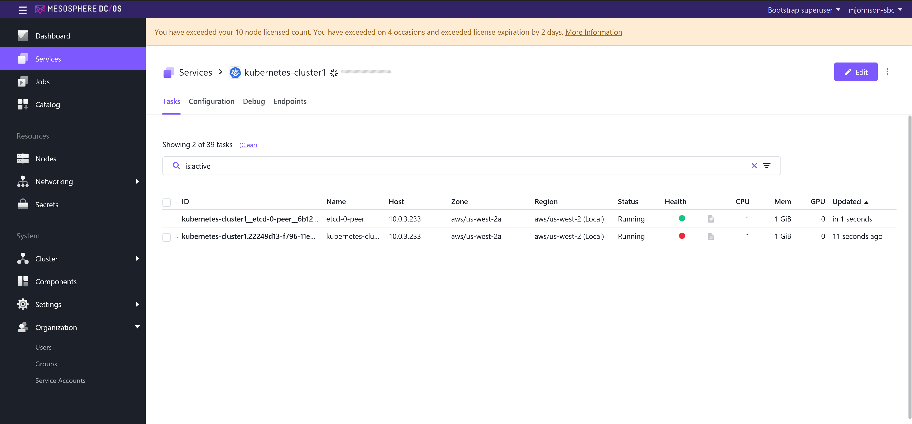

1. Click on the cluster name and explore the options while the cluster is deploying
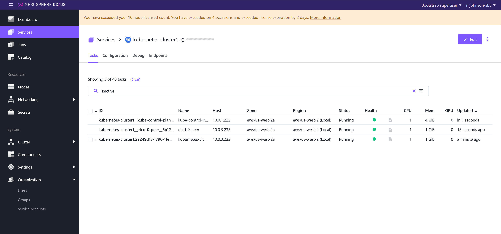

You have now successfully created a Kubernetes cluster.

Find and review the Kubernetes documentation on-line.
Mesosphere Kubernetes Engine/Cluster Documentation: https://docs.mesosphere.com/services/kubernetes/2.1.1-1.12.4

