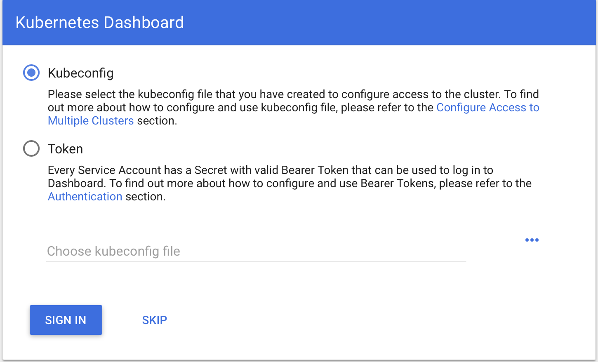
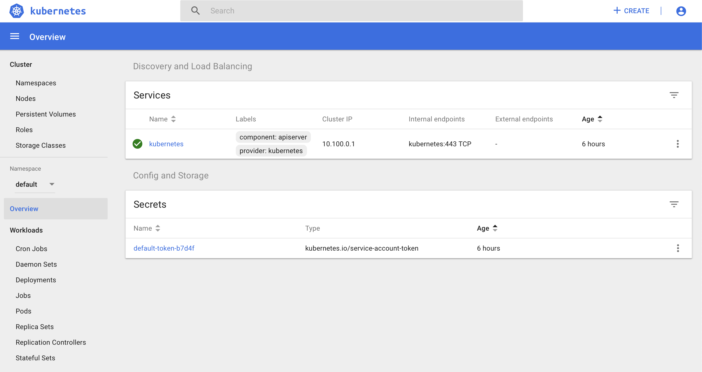
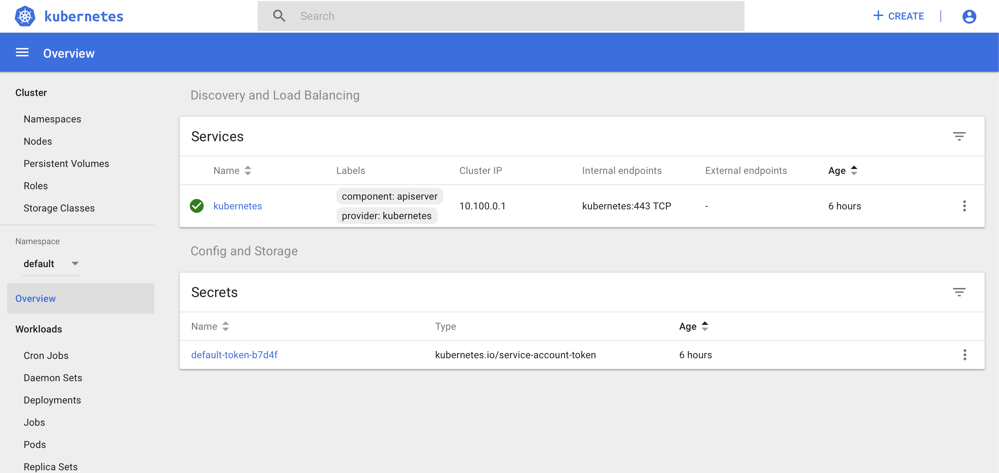

# Lab 2: Setup Kubernetes tools

# Overview
This lab is designed to expose the participant to setting up ```kubectl``` for your cluster, inspect the kubernetes cluster 
  As part of this lab you will have the opportunity to learn the following:
* Configure ```kubectl``` CLI
* How to inspect your Kubernetes cluster
* Work with the DC/OS CLI
* Log into DC/OS as a team admin user
* Connect to the Kubernetes dashboard
* Deploy a sample application to your cluster


**Estimated time required:** 30 minutes

# Pre-requisites
* Access to a Mesosphere Kubernetes Engine (MKE) cluster
* DC/OS login for just your cluster


| Team Project Property | Project Value  |
|-----------------------|----------------|
| CLUSTER_NAME          |  ___kubernetes-cluster{Team Number}____              |
| MKE Login     |  __mke{Team Number}/_mesosphere_______              | 
| EDGE_LB_PORT | __{6442 + Team Number}_________ |

## Part I: Setup ```kubectl```
1. Make certain that kubectl is installed on your client workstation

1. From the workstation command prompt login to DC/OS with your MKE Login and password
   ```angular2
   dcos auth login
   ```

   Assuming the login was successful you can proceed to the next step.
1. Set kubeconfig to point to your cluster

```
dcos kubernetes cluster kubeconfig \
    --insecure-skip-tls-verify \
    --verbose \
    --context-name=${CLUSTER_NAME} \
    --cluster-name=${CLUSTER_NAME} \
    --apiserver-url=https://${PUBLIC_IP}:EDGE_LB_PORT
```

Then to validate that the kubeconfig is properly setup, execute the following two commands:

```
kubectl config use-context ${CLUSTER_NAME}
kubectl cluster-info
kubectl get nodes
```

If successful, you will see a list of nodes associated with your Kubernetes cluster created in Lab 1 .  You are now ready to proceed to the next step so you can manage your cluster and Kubernetes services .

The user you have authorized yourself with will have access only to your Kubernetes clusters.  You can see the list of kubernetes clusters by entering the command below:
```
dcos service
```
You will see a service with your Kubernetes cluster CLUSTER_NAME in the output of this command.


## Part II: Access Kubernetes dashboard
As powerful as ```kubectl``` can be, often it is easier to utilize the Kubernetes dashboard.  The following instructions detail how to setup the kubernetes dashboard for your cluster.  Once we have kubeconfig setup for your kubernetes cluster,

The Kubernetes dashboard is accessible via a proxy.  To enable the proxy enter the following command:

```
kubectl proxy
```

**NOTE:** This command will not return the command line unless you run it in the background.

Now that the proxy is setup, open your browser to the url: ```http://127.0.0.1:8001/api/v1/namespaces/kube-system/services/https:kubernetes-dashboard:/proxy/```

1. The browser will display the dashboard login screen as it appears below.  You will want to specify the kubeconfig directory at "~/.kube/config"

    

1. Upon successful login, you will see the main Kubernetes Dashboard as shown below
    
    
1. Clicking on the "Nodes" icon wil show the nodes for your cluster as shown below:
    

 
## Part III: Deploy a sample Application


### Use the Kubernetes-cluster2 K8s Dashboard

Ensure that you have connectivity to Kubernetes-cluster2 by pointing your browser to:

http://127.0.0.1:8001/api/v1/namespaces/kube-system/services/https:kubernetes-dashboard:/proxy/

If the above URL does not work, then the kubectl proxy needs to be restarted.  We need to ensure that we have selected the kubernetes-cluster2.  To do this:

Kubectl can only control one Kubernetes cluster at a time.  We need to ensure that we have selected the kubernetes-cluster2.  To do this:

```
$ kubectl config get-contexts

CURRENT   NAME                  CLUSTER               AUTHINFO              NAMESPACE
          kubernetes-cluster1   kubernetes-cluster1   kubernetes-cluster1
 *        kubernetes-cluster2   kubernetes-cluster2   kubernetes-cluster2
```

If the other cluster is selected then change to kubernetes-cluster2 (unlike the example above):
```
$ kubectl config use-context kubernetes-cluster2

Switched to context "kubernetes-cluster2".
```


To access the dashboard run:
```
kubectl proxy --port=8001
```

### Setup and Deploy the Sock Shop

Now we can deploy the app from the Kubernetes Dashboard. 

1. Click on ```Namespaces```
1. Select [+ Create] at the top of the screen
2. Select tab - [Create from file]
3. Select [...] to choose YAML or JSON
4. Select the sockshop-namespace.yaml file
5. Select Upload


#### Now deploy on Kubernetes.
Locally create 'sockshop-namespace.yaml' from the text below:

```
cat > sockshop-namespace.yaml << EOF
{
  "kind": "Namespace",
  "apiVersion": "v1",
  "metadata": {
    "name": "sock-shop",
    "labels": {
      "name": "sock-shop"
    }
  }
}
EOF
```

#### Create Sock-shop Deploy YAML

To save 'sockshop-deploy.yaml' locally, run the following command:

```
curl https://raw.githubusercontent.com/microservices-demo/microservices-demo/master/deploy/kubernetes/complete-demo.yaml > sockshop-deploy.yaml
```

**The sock-shop namespace is selected by default, but ensure that you are within it first.**  Green line within screenshot below shows the selected namespace.

1. Select [+ Create] 
2. Select tab - [Create from file]
3. Select [...] to choose YAML or JSON
4. Select the sockshop-deploy.yaml file
5. Select Upload


Wait a couple of moments while the application deploys.  Once the Workload Statuses are green, then you are successful.


### Login to Access the Sock Shop website

Use the public IP for the other DC/OS public agent 
- The first public IP used was for the DC/OS Marathon-LB
- This agent is running the public kubelet now hosting the Sock Shop website


http://\<DCOS PUBLIC IP\>:30001


You have now deployed a full website in Kubernetes running on Mesosphere DC/OS.

This website includes 13 containers:
- 4 Mongo DBs (Cart database, Orders database, User databases)
- 3 Java Apps (Cart app, Order app, Shipping app)
- MySQL DB (Catalogue database)
- 4 Docker Containers (Catalogue app, Front-end app, Payment app, Queue-master app)
- RabbitMQ


